# Überblick

Das Frontend basiert auf dem Javascript-Framework für Frontendentwicklung "React.js". 
Es wurde mit den standard Entwicklertools von React durch npx initiiert (siehe "Entwicklung" und Getting Started der React Dokumentation).

React.js wurde eingesetzt, da es mit seiner Komponenten-basierten Architektur sehr einfach in bestehende Projekte einzubinden ist. Komponenten können innerhalb der Hierarchie der Anwendung schnell "umgehangen" werden. Diese Kapselung durch Komponenten (Entkopplung)  - angelehnt an das Prinzip der minimalen Kopplung in der Objektorientierten Programmierung - ermöglicht die Wiederverwendung von Sub-Komponenten für verschiedene Zwecke. React.js kann von Anfängern in der Frontend-Entwicklung mit wenig Erfahrung in Javascript nach dem Prinzip "Learning by Doing" schnell erlernt werden.

Grund für die Auswahl der Sprache Javascript sowie der Entscheidung für eine Web-Applikation, ist der Geräteunabhängige Einsatz der Applikation.
Die meisten aktuellen Desktop-PCs und Smartphones - unabhängig des Herstellers - bieten mit den Standard-Browsern alle nötigen Voraussetzungen, um diese App später ausführen zu können. Dank der Standards, die W3C für die APIs im Browser durchsetzt sollten nahezu alle Funktionalitäten sowohl auf dem Smartphone, als auch auf dem Desktop äquivalent funktionieren. 

Besonders "spezielle" Funktionalitäten, die vorher nur "nativen" Apps auf dem Smartphone vorbehalten waren sind nun auch für reine web-basierte Anwendungen nutzbar. So kann eine mit SSL gesicherte Web-App unteranderem nun auch eine lokale Datenbank im Browser anlegen (Indexed DB), die Kamera des Smartphones oder Desktop-PCs verwenden, das Mikrofon bei Bedarf ansteuern, die Daten des 3-Achsenbeschleunigungs-Sensors auslesen, Benachrichtigungen anzeigen, das Smartphone vibrieren lassen, auf die Bluetooth-Schnittstelle zugreifen und vieles mehr.

Für die Anwendung des Bachelorsnight Ticketsystems wurden folgende "spezielle" Funktionalitäten zusätzlich eingebunden:

- *Service Worker* für einen Einlass ohne Internet Verbindung (App wird als "Progressive Web App" offline im Browser zwischengespeichert)
- *Indexed DB* für den besagten Einlass zum zwischenspeichern aller Ticketdaten von der Blockchain
- *WebRTC* für den Einlass, sodass mehrere Geräte als Ticketleser innerhalb eines lokalen Netzwerkes mit einem Hauptgerät (Master) mit den Ticket-Daten in der Indexed DB kommunizieren können.
- *Kamera-Funktionalität* für den Einlass, sodass eine Peer-to-Peer-Verbindung zwischen Master und Ticket-Lesern aufgebaut werden kann, ohne etwas eintippen zu müssen. Zusätzlich auch, um die QR-Codes der Tickets scannen zu können.

# Schnellstart

# Komponenten im Detail

## App

Übergeordnete Komponente, die zentrale App-Daten verwaltet.
Hier wird ebenfalls der System-Status in regelmäßigen Abständen (60 Sek.) überprüft.
Ein globaler Kontext für den Benutzer wird hier bereitgestellt (UserContext).

## Gast

### BookingOverview
Die Komponente BookingOverview zeigt die Buchungen und die in den Buchungen enthaltenen Tickets für den aktuell angemeldeten Benutzer an.
Die Komponente besteht aus den Klassen:
- BestellungsItem
- BookingOverview

Die Klasse BookingOverview ruft für den aktuell angemeldeten Benuzter über die Route 
```
"/api/v2/users/{ID des aktuell angemeldeten Benutzers}/bookings"
```
die für den Benutzer in der Datenbank gespeicherten Buchungen ab.
Anhand der erhaltenen Buchungen werden die in der Buchung enthaltenen Tickets über die Route
``` 
"/api/v2/bookings/{Buchungs-ID}/ticketsBooked"
```
abgerufen.
Die empfangenen Daten zu den Buchungen und Tickets werden von der Klasse BookingOverview an die Klasse BestellungsItem übergeben. Die Klasse BestellungsItem erstellt aus den Daten AccoridionPanels, die anschließend im Accordion der Klasse BookingOverview angezeigt werden. 

### Ticket Bestellung
Die Komponente TicketBestellung erstellt die Buchungen und Tickets für den angemeldeten Benutzer. 
Die Komponente besteht aus den Klassen:
- TicketBestellung
- PersonInput

Die Klasse Ticketbestellung stellt den Verkaufsprozess der Tickets dar.
Die Klasse PersonInput ist eine Hilfsklasse für die TicketBestellung die zur Eingabe der Namen der Gäste verwendet wird.

In dem Ticketbestellprozess springt der Absolvent von Window zu Window und wird einfach durch den Prozess des Ticketverkaufs gelotst.
Im ersten Window muss der Absolvent seinen Namen und seinen Nachnamen ausfüllen, da beim Einlass das elektronische Ticket mit dem Personalausweis abgeglichen wird.
Im zweiten Fenster werden ggf. die Gäste des Absolvent hinzugefügt. Im ersten Verkaufsdurchlauf haben die Absolventen die Möglichkeit maximal zwei Personen mitzunehmen.
Im dritten Fenster gibt es dann die Möglichkeit Parktickets in Abhängigkeit der Besucher + 1 Ticket für den Absolventen zu erwerben.
Im vierten Fenster ist der Warenkorb dargestellt mit den Tickets die bestellt werden. Anschließend kann man die Bestellung Zahlungspflichtig bestellen.
Sobald das fünfte Fenster sich öffnet wurden die Buchung ausgeführt und die Tickets in die DB geschrieben.

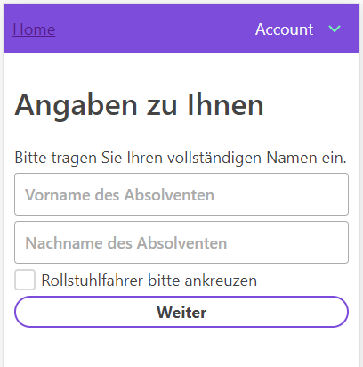 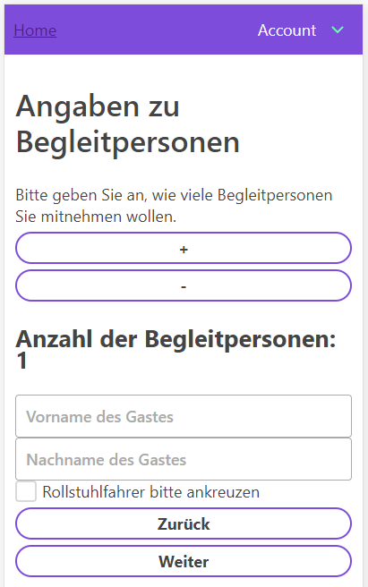 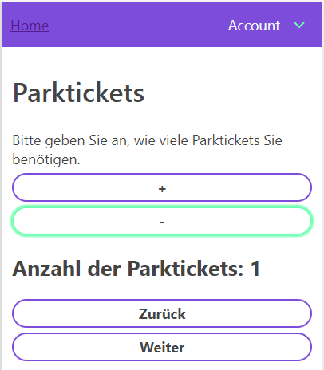 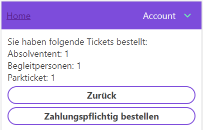 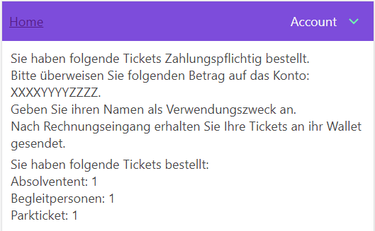


## Eventmanagament

### EventManagement

### ShopManagament
Die Komponente ShopManagament ist für die Anzeige von Statistiken und Einstellungen während des Verkaufs der Tickets zuständig.


Die Komponente besteht aus den Klassen:
- DataQuickViewMaxTickets
- DataQuickViewPayment
- DataQuickViewBookings
- DataQuickViewSalesStatistics
- DataQuickViewManageSales
- DataQuickViewCreateOTPS
- DataQuickViewManageOTPS
- DataQuickViewViewOTPs
- ShopManagement

und interagiert mit den Komponenten
- ShopManagamentConfMaxTickets
- ShopManagementManageSales
- ShopManagamentViewBookings
- ShopManagementPaymentOptions
- ShopManagementManageSalesStatus
- ShopManagamentAbsolventenListe
- ShopManagementManageOTPS
- ShopManagementViewOTPs

#### Klasse - ShopManagament
Die Klasse ShopManagament ist für die Anzeige der entsprechenden Klassen und Komponenten sowie die Verwaltung der zentralen Daten für die Anzeigen verantwortlich. Die Klasse stellt Setter-Funktionen für die entsprechenden Werte bereit, die die einzelnen (DataQuickView)-Klassen aufrufen um die Werte in der Klasse ShopManagamenet zu ändern. In der Klasse ShopManagement sind die HTTP-Requests an das Backend hinterlegt und werden von den jeweiligen Komponenten aufgerufen.Durch die Funktion componentDidMount werden beim Laden der Klasse initial die Buchungen, Tickets und Config-Werte abgefragt.

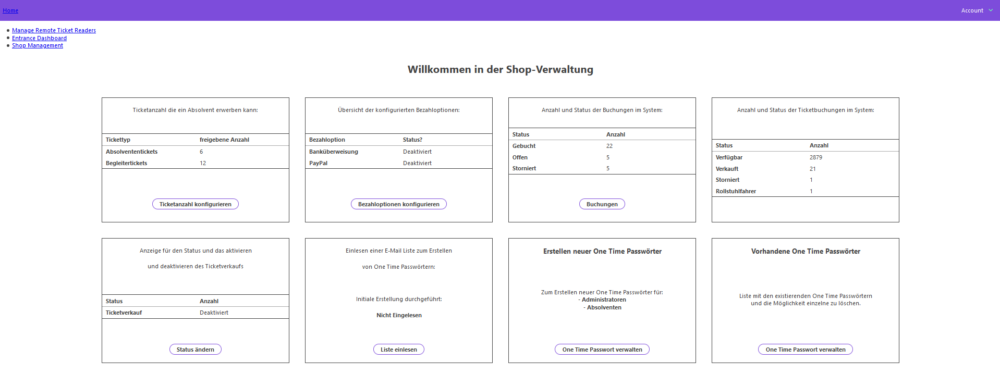

#### Klasse - DataQuickViewMaxTickets
Die Klasse DataQuickViewMaxTickets zeigt die Anzahl der Tickets an, die ein Absolvent mit der derzeitigen Konfiguration erwerben kann. Mit dem Button der Klasse wird der Administrator zur Komponente ShopManagementConfMaxTickets weitergeleitet.

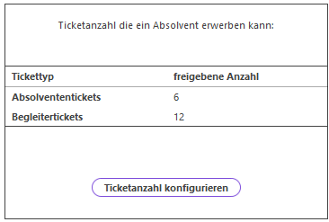

#### Komponente - ShopManagamentConfMaxTickets
Die Komponente ShopManagamentConfMaxTickets stellt Textfelder zur Verfügung, mit denen die maximalen Tickets, die ein Absolvent erwerben kann, konfiguriert werden können. Die Werte  werden von der Klasse ShopManagement mit der Route
```
{
    Route: */api/v2/shopConfig
}
```
im Backend in der Konfigurationsdatei gespeichert.

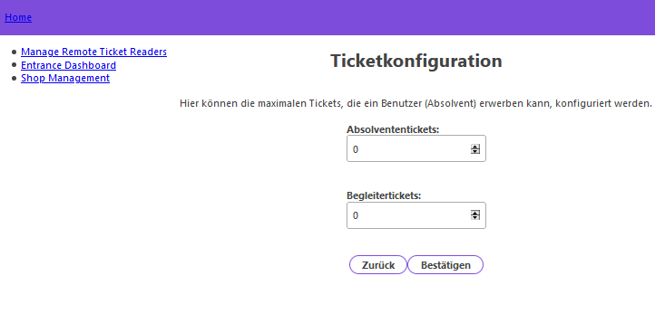

#### Klasse - DataQuickViewPayment
Die Klasse DataQuickViewPayment zeigt den aktuellen Status für die konfigurierbaren Zahlungsmethoden der Banküberweisung und der PayPal-Überweisung an. Mit dem Button der Klasse wird der Administrator zur Komponente ShopManagementPaymentOptions weitergeleitet.

#### Komponente - ShopManagementPaymentOptions
Die Komponente ShopManagementPaymentOptions stellt jeweils Textfelder für die Bankverbindung und die PayPal-Verbindung zur Verfügung, anhand welcher diese näher spezifiziert werden können. Für die Bankverbindung kann so ein Empfängername, ein Bankname, eine IBAN, eine BIC sowie ein gewünschter Verwendungszweck zur Überweisung vorgegeben werden. Für die PayPal-Verbindung kann ein PayPal.me-Link, eine PayPal-Mailadresse sowie ein gewünschter Verwendungszweck für die PayPal-Transaktion vorgegeben werden. Die Werte werden nach der Bestätigung durch den jeweiligen Button von der Klasse ShopManagementPaymentOptions mit der Route 
```
{
    Route: */api/v2/paymentOptions
}
```
im Backend in der Konfigurationsdatei für die Zahlungsmethoden gespeichert.

Zudem können die Zahlungsmethoden in der Komponente aktiviert und deaktiviert werden, indem der gewünschte Zustand in der jeweiligen Dropbar ausgewählt und mit dem Button bestätigt wird. Die Zustände werden ebenfalls durch die Betätigung des jeweiligen Buttons von der Klasse ShopManagementPaymentOptions mit der Route 
```
{
    Route: */api/v2/paymentOptions
}
```
im Backend in der Konfigurationsdatei für die Zahlungsmethoden hinterlegt.

#### Klasse - DataQuickViewBookings
Die Klasse DataQuickViewBookings zeigt die aktuelle Anzahl offener, gebuchter und stornierter Buchungen im System an. Mit dem Button der Klasse wird ein Administrator zur Komponente ShopManagementViewBookings weitergeleitet.

#### Komponente - ShopManagementViewBookings
Die Komponente ShopManagementViewBookings gibt einen ausführlichen Überblick in Form einer Liste über alle Buchungen im System, welche noch als offen gekennzeichnet sind sowie über alle Buchungen im System, welche bereits als bezahlt markiert wurden. Die Komponente bietet für beide Listen die Möglichkeit, über ein listenspezifisches Suchfeld nach Buchungen mit einer spezifischen E-Mail-Adresse zu suchen. Die noch als offen markierten Buchungen können durch die Komponente freigegeben oder storniert werden, indem der zugehörige Button in der Listenzeile verwendet wird. Die als bezahlt markierten Buchungen können durch die Komponente auf die selbe Art und Weise storniert werden.

#### Klasse DataQuickViewSalesStatistics
Die Klasse DataQuickViewSalesStatistics gibt einen Überblick über die noch vorhandene Platzanzahl, über die bereits verkaufte Platzanzahl, über die Anzahl stornierter Tickets, über die Anzahl der Rollstuhlfahrer sowie über die Anzahl der gebuchten Parktickets. Die Werte für die verschiedenen Parameter werden von der Klasse Shopmanagement abgerufen. 

#### Klasse - DataQuickViewManageSales
Die Klasse DataQuickViewManageSales zeigt den Status des Verkaufs an. Dieser kann Aktiv oder Deaktiviert sein. Der Wert für den Status wird von der ShopManagement abgerufen. Der Button der Klasse leitet den Administrator zur Komponente ShopManagementManageSalesStatus weiter.

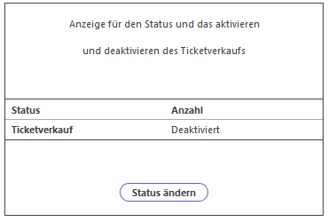

#### Komponente - ShopManagementManageSalesStatus
In der Komponente ShopManagementManageSalesStatus kann der Status des Verkaufs über das Drop-Down Menü aktiviert / deaktiviert werden. Der Status wird von der Klasse ShopManagement mit der Route
```
    Route: */api/v2/shopConfig
```
in der Konfigurationsdatei des Backends gespeichert.

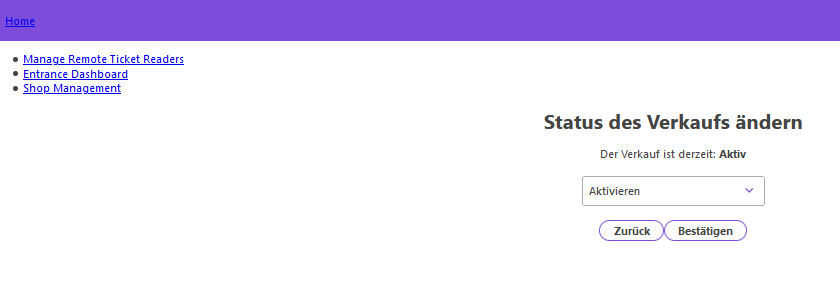

#### Klasse - DataQuickViewCreateOTPS
Die Klasse DataQuickViewCreateOTPS zeigt an, ob bereits eine Liste mit E-Mail-Adressen für die Erstellung der One Time Passwörter und den anschließenden E-Mail-Versand eingelesen wurde. Mit dem Button "Liste einlesen" wird der Administrator zur Komponente ShopManagamentAbsolventenListe weitergeleitet.

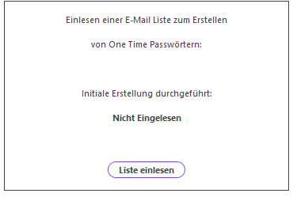

#### Komponente - ShopManagamentAbsolventenListe
Die Komponente ShopManagamentAbsolventenListe stellt ein CSV-Reader Feld der Komponente "react-papaparse" zur Verfügung. Mit der Eingabe einer Liste im CSV-Format in der Darstellung
```
eMail;Name
Beispiel@web.de; Mustermann, Max
                .
                .
                .
```
kann eine Liste mit E-Mail-Adressen eingelesen werden. Die eingelesene Liste wird in der Komponente in einer Liste angezeigt. Durch die Bestätigung der eingelesen Liste mit dem Button Abschließen wird für jeden Datensatz in der Liste die Route
```
    Route: */api/v2/oneTimePasses
```
aufgerufen und ein One Time Passwort in der Datenbank erstellt, sowie eine E-Mail mit dem erstellten One Time Passwort versendet. Die Komponente kann nur Benutzer / One Time Passwörter mit der Rolle 1 (Absolvent) erstellen.

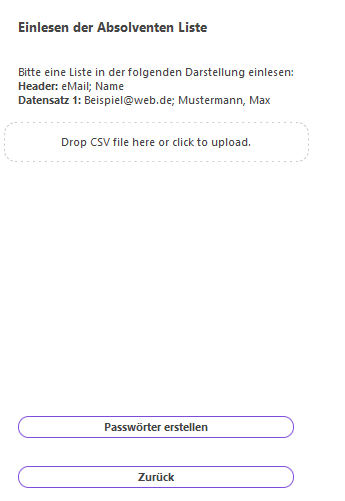

<link src="./assets/ShopManagamentAbsolventenListe.csv" alt="Template ShopManagamentAbsolventenListe">

#### Klasse - DataQuickViewManageOTPS
Mit dem Button der Klasse DataQuickViewManageOTPS kann zur Komponente ShopManagementManageOTPS gewechselt werden.

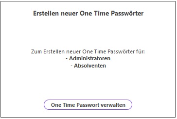

#### Komponente - ShopManagementManageOTPS
In der Komponente ShopManagementManageOTPS können neue One Time Passwörter erstellt werden. In das Textfeld muss eine E-Mail-Adresse eingetragen werden und über das Drop-Down-Menü kann die entsprechende Rolle ausgewählt werden. (Rolle 0 = Administrator; Rolle 1 = Benutzer)

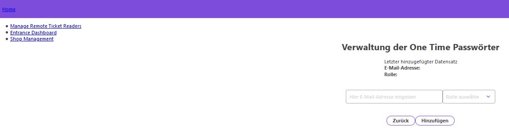

#### Klasse - DataQuickViewViewOTPs
Die Klasse DataQuickViewViewOTPs stellt einen Button bereit, mit dem der Administrator zur Komponente ShopManagementViewOTPs wechseln kann.

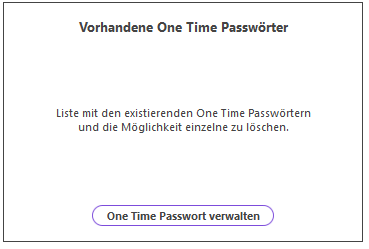

#### Komponente - ShopManagementViewOTPs
Die Komponente ShopManagementViewOTPs ruft über die Route
```
Route: */api/v2/oneTimePasses
```
die in der Datenbank hinterlegten One Time Passwörter ab und strukturiert diese in einer Liste. Mit dem Button OTP löschen im Listenelement kann ein One Time Passwort aus der Datenbank gelöscht werden. Hierfür wird die Route
```
    Route: */api/v2/oneTimePass/{ID}
```
im Backend verwendet.

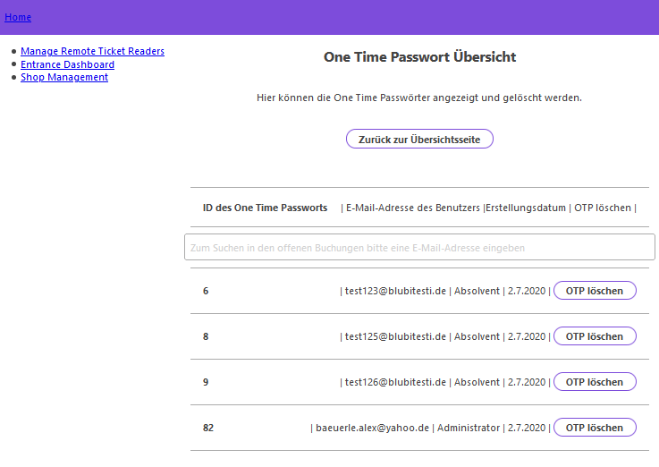

### SystemSetup
Die Komponente SystemSetup ist für die erstmalige Konfiguration im Backend verantwortlich. Ist im Backend keine Konfiguration gesetzt, schaltet der Server in den Wartungsmodus.

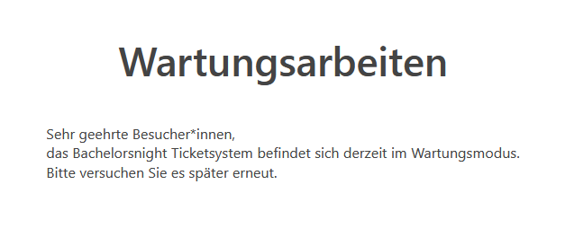

Mit der Route
```
{
    Route: */setup/  
}
```
kann zur Komponente SystemSetup gewechselt werden. 

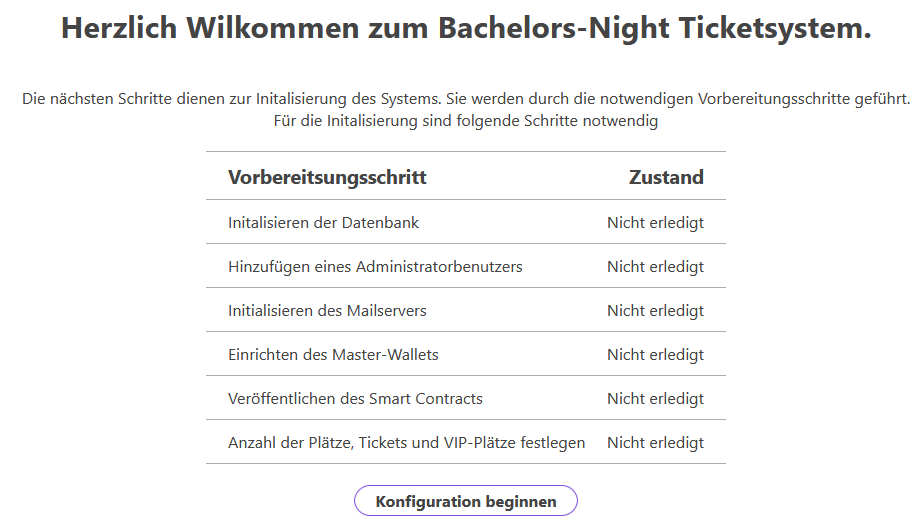

Die Komponente besteht aus den Klassen:
- Systemsetup
- Hauptansicht
- ConfigureDatabase
- ConfigureAdminAccount
- ConfigureMailserver
- AddWallet
- Deploy Smart Contract
- Configure ShopConfig

#### SystemSetup
Die Klasse SystemSetup verwaltet die MAP mit den Werten welche Einrichtungsschritte bereits abgeschlossen sind und stellt die Funktion changeValueOfmapTest zum ändern der Werte zur Verfügung. Zusätzlich steuert die Klasse, welche anderen Klassen in der Weboberfläche angezeigt werden mit dem Wert InitializeStep und der Funktion changeStep.

Wird die Komponente zum ersten Mal geladen, besteht nur die Option die Konfiguration initial durchzuführen mit dem Button "Konfiguration beginnen.

Die einzelnen Einrichtungsschritte können mit dem Button "Abschließen" / "Hinzufügen" durchgeführt werden. Diese Option besteht nur einmal, da die Daten anschließend im Backend gespeichert sind.

Mit dem Button "Schritt überspringen" können einzelne Einrichtungschritte ohne das Absenden der Daten übersprungen werden, so dass der Administrator die Möglichkeit hat, einzelne Schritte auszulassen, wenn die entsprechenden Daten fehlen oder der Einrichtungsschritt bereits durchgeführt wurde.

Wurden die Einrichtungsschritte des SystemSetups einmal durchgeführt, besteht die Möglichkeit mit dem Button "Zurück" zur ersten Ansicht (Hauptansicht - 0) zu wechseln und das SystemSetup erneut durchzuführen.

Mit dem Button "Initialisierung abschließen" wird die Komponente geschlossen und die Route
Über die Route
```
{
    Route: */login 
}
```
geladen. 


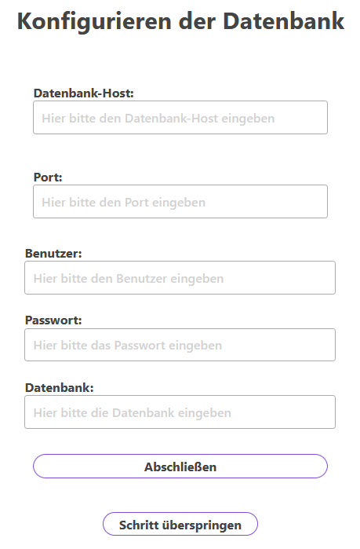
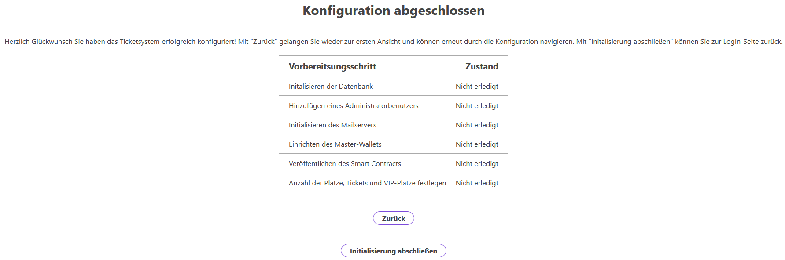

#### Hauptansicht
Die Hauptansicht ruft die MAP mit den Einrichtungsschritten ab und zeigt diese in einer Tabelle an. Die Boolean- und Key-Werte der Map werden in sprechendere String Werte übersetzt. Die Hauptansicht wird zu Beginn (InitializeStep = 0) und am Ende (InitializeStep = 7) des Einrichtungsvorgangs angezeigt.


#### ConfigureDatabase
Die Klasse ConfigureDatabase stellt 5 Textfelder für die Eingabe der Daten zur Datenbank zur Verfügung. Über die Route 
```
{ 
    Route: */setup/database
}
```
werden die Daten in der Konfiguration gesetzt und das Schema der Datenbank wird initial erstellt.


#### ConfigureAdminAccount
Die Klasse ConfigureAdminAccount stellt ein Textfeld für die Eingabe einer E-Mail-Adresse und ein Passwort für den Administratorbenuzter zur Verfügung. 
```
{
    Voraussetzungen: Intitialisierte Datenbank   
}
```

Über die Route
```
{
    Route: */setup/adminUser  
}
```
wird der Administratorbenutzer (Rolle 0) im Backend erstellt und in der Konfigurationsdatei des Backends als erstellt gekennzeichnet.

#### ConfigureMailserver
Die Klasse ConfigureMailserver stellt 6 Textboxen und ein Drop-Down Menü zur Eingabe der Daten für den Mail-Server zur Verfügung. Über die Route 
```
{
    Route: */setup/mailserver
}
```
werden die Einstellungen in die Konfiguration im Backend gespeichert.

#### AddWallet
Die Klasse AddWallet stellt ein Textfeld zur Eingabe des HTTP-Providers bereit und sendet dieses über die Route 
```
{
   Route: */setup/generateWallet
}
```
an das Backend. Das Backend erstellt ein Wallet für den Admin. Ist die Einrichtung des Wallets erfolgreich abgeschlossen, zeigt die Ansicht der Komponente den Ethereum-Preis für die Veröffentlichung des Smart Contracts auf der Blockchain an.

#### DeploySmartContract
Die Klasse DeploySmartContract stellt ein Textfeld zur Eingabe des HTTP-Providers zur Verüfung. Im Admin-Wallet wird eine bestimmte Menge Ethereum benötigt. Dieses ist für die Veröffentlichung des Smart Contracts und die Erstellung eines Tickets.
```
{
Voraussetzungen:    - Erstelltes Wallet
                    - Ethereum im Wallet
}
```
Der Smart Contract wird über die Route
```
{
    Route: */setup/deployContract
}
```
im Backend auf der Blockchain veröffentlicht. Nach der erfolgreichen Veröffentlichung des Smart Contracts werden in der Klasse die Preise für die Erstellung und die Übertragung eines Tickets angezeigt.

#### ConfigureShopConfig
Die Klasse ConfigureShopConfig stellt 3 Textboxen für die Eingabe der maximalen Personen pro Event, die maximale Anzahl von Tickets und die maximale Anzahl an VIP-Personen zur Verfügung. Die Werte werden über die Route
 ```
{
    Route: */setup/shopConfig
}
```
in die Konfigurationsdatei im Backend gespeichert.

### Entrance Dashboard (Event Management)

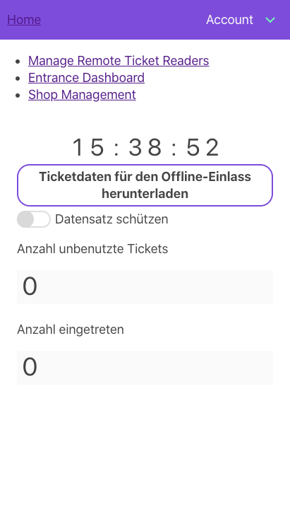 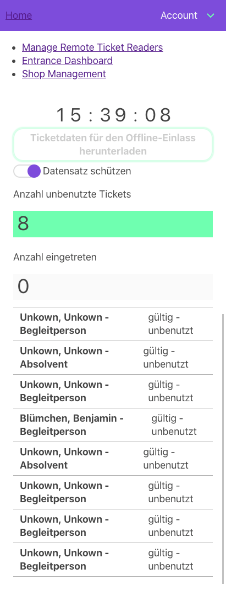

Das Einlass Dashboard ist zur Überwachung des aktuellen Einlass-Prozesses da. Es stellt die absolute Anzahl der eingelassenen Personen (Kategorie 1) sowie die Anzahl der noch nicht eingelösten Tickets dar (Kategorie 2). Grafische Darstellungen in Form von Balken-Diagrammen veranschaulichen den relativen Anteil der beiden Kategorien.

Diese Komponente macht sich die Offline-Funktionalität und Indexed-DB zur Nutze. Ein Klick auf den Download Button reicht aus, um vom Backend ein Dump der Ticket-Daten aus Blockchain und interner DB anzufordern. Anschließend wird die Schaltfläche zum Schutz vor versehentlichem Überschreiben der Indexed-DB deaktiviert. Erst durch den darunterliegenden Schalter, welcher eine Warnung ausgibt, kann der Offline-Datensatz komplett neu geladen (überschrieben) werden.

Für Details zur Indexed-DB siehe Kapitel "Spezielle Funktionalitäten".

### Ticket Leser Management (Event Management)

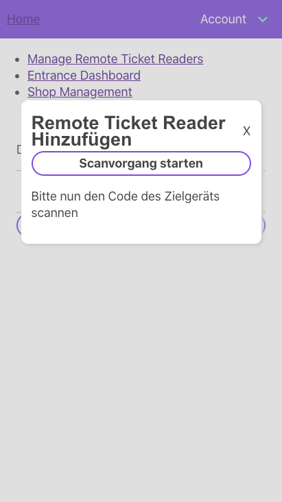 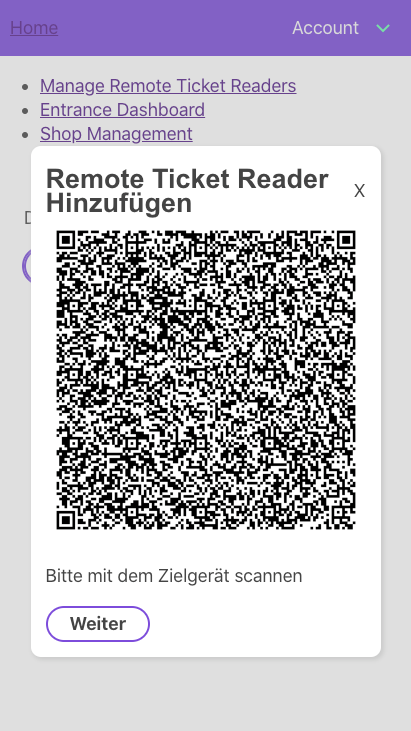 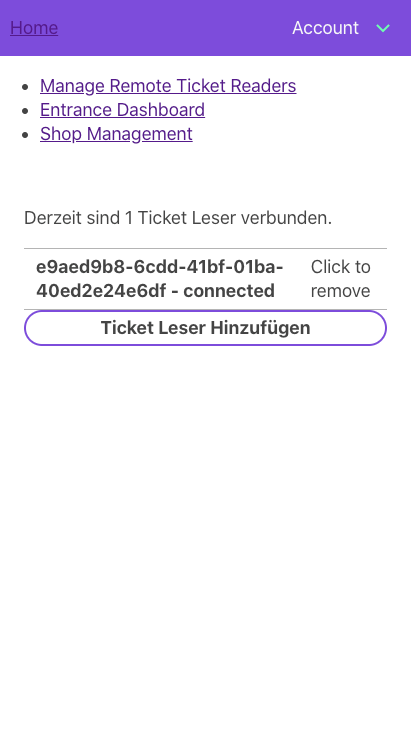

Diese Komponente wurde zum Hinzufügen und Entfernen von Remote-Ticketlesern für den Einlass entwickelt. Ein Remote-Ticketleser kann über einen geführten Dialog angelegt werden. Mithilfe von QR-Codes werden dabei Konfigurationen zur Kommunikation zwischen Ticketleser und dieser Komponente (Master) ausgetauscht. Für Details zum Thema Kommunikation der Ticketleser mit dem Master, siehe "Spezielle Fumktionalitäten".

Wurde ein Remote-Ticketleser hinzugefügt (neue Instanz der Klasse RemoteTicketReader), wird der aktuelle Verbindungsstatus in der Liste auf dieser Komponente angezeigt. Wird die Verbindung kurzzeitig unterbrochen, so wird die Statusanzeige aktualisiert. Ist die Verbindung dauerhaft fehlgeschlagen, so wird der Ticketleser aus der Liste entfernt.

Würde diese Komponente geschlossen, würden alle Instanzen der Remote-Ticketleser vom Garbage-Collector gelöscht werden. Um das zu verhindern, werden die Instanzen der RemoteTicketReader-Klasse in der Komponente EventManagement in einem Array gehalten. Der Ticket-Leser-Manager erhält die Liste per React-Properties. Somit kann nachdem der Administrator einige Ticketleser aktiviert hat, auf die Komponente des Entrance-Dashboard wechseln.

### Entrance (Ticketleser)


# Spezielle Funktionalitäten

## Login und Benutzer-Erstellung

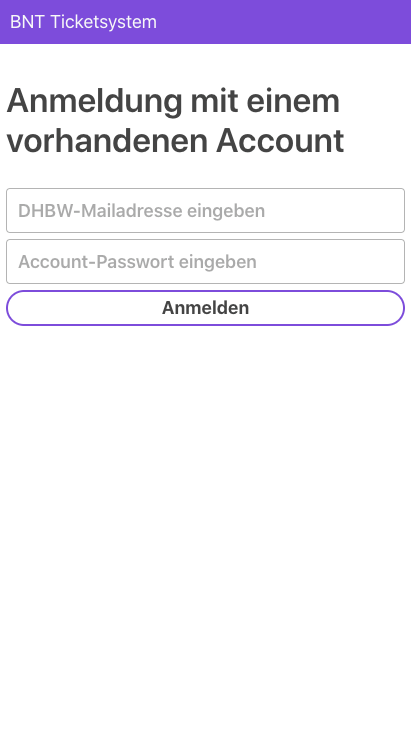 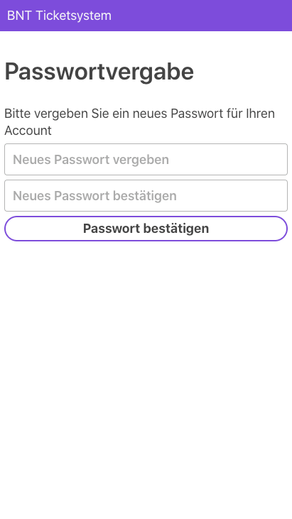 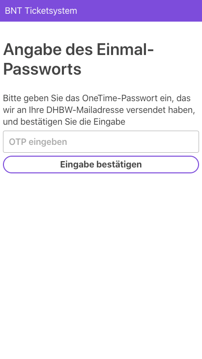 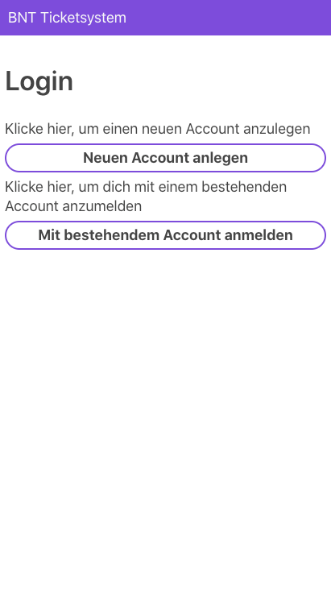

Zum Anmelden des Benutzers existiert die Komponente Login. Hiermit kann ein neuer Account mithilfe eines Einmal-Passworts (OTP) erstellt werden. Das entsprechende OTP muss zuvor vom Admin angelegt werden und zeigt auf eine vordefinierte Rolle und eine unveränderliche E-Mailadresse.

Beim Erstellprozess eines neuen Benutzers wird diesem vom Backend aus ein Access-Token, eine eindeutige Benutzer-ID, die vorgegebene E-Mail-Adresse und eine Rolle zugewiesen. Diese Werte werden sowohl in der Datenbank als auch hier im Frontend im LocalStorage des Browsers zwischengespeichert. Das Passwort ist jeweils nur als gesalzener Hashwert im Speicher. Der Access-Token wird bei zukünftigen Anfragen an das Backend benötigt.

Nach einer normalen Anmeldung mit E-Mail-Adresse und Passwort erhält das Frontend vom Backend die Benutzer-Daten und einen API-Token. Beides wird im LocalStorage des Browsers gespeichert.

In beiden Situationen ist der Benutzer anschließend angemeldet. Der entsprechende UserContext (siehe nächster Abschnitt) hält zur Laufzeit benötigte Funktionen zur verfügung.

## Globaler Benutzer-Kontext (UserContext)

Um über die App hinweg ein global verfügbares Benutzer-Objekt zu haben und Berechtigungen zu überprüfen, wird von der Hauptkomponente (App.js) ein React-Context erzeugt. Dieser hält den angemeldeten Benutzer mit seinen Eigenschaften, den aktuellen API-Token und einige nützliche Funktionen. Die Eigenschaften und Methoden sind im Detail wie folgt aufgebaut:

```
{
    user: User, // Siehe Backend-Route GET: User
    token: String, // Aktueller API-Token
    logout: Method, // Löscht den LocalStorage (und die IndexedDB bei Bedarf), leitet anschließend nach #/login/ um
    setUserContext: Method, // Setzt das Objekt im LocalStorage neu -> Hier bitte immer nur ein JS-Objekt mit { user: User, token: String } übergeben.
    requireLogin: Method, // Erfordert eine Zahl für die zwingende Rolle als Parameter und prüft daraufhin ob die Bedinungen gegeben sind. Sollte von jeder Komponente aufgerufen werden, die eine Anmeldung erzwingt.
    redirectUserToHome: Method // Kann verwendet werden, um den aktuellen Benutzer auf Basis seiner Rolle an seine "Hauptseite" zu leiten
}
```

## Offline-Funktionalität und Indexed DB für den Einlass

## Verbindung zwischen Ticketleser und Ticketlesermaster (Peer-to-Peer)
Aktuelle, weitverbreitete Webbrowser unterstützen die sogenannte WebRTC API. Mithilfe dieser API kann eine Peer-to-Peer Verbindung zwischen zwei unabhängigen Geräten über den Webbrowser aufgebaut werden. Voraussetzung ist eine bestehende Netzwerkverbindung, die entweder über das Internet eine Kommunikation ermöglicht oder direkt über ein lokales Netzwerk. Für detaillierte Informationen über die einzelnen Komponenten dieser API sollte die Referenz zur Rate gezogen werden.

Für den Anwendungsfall "Ticketleser" wird zwischen Master und Client unterschieden. Die Master-Komponente ist im Event-Management-Bereich der Frontend-Applikation angesiedelt. Die Client-Komponente bestimmt die Nutzbarkeit der Einlass-Komponenten (Ticketleser). Es ist vorgesehen, dass die Kommunikation über ein lokales Netzwerk stattfindet. Somit ist es Voraussetzung, dass die Applikations-Teile von Master und Client bereits auf den entsprechenden Geräten als offline verfügbare Progressive-Web-App zwischengespeichert wurde. Dazu sollte mindestens einmal die entsprechende URL des Ticket-systems online aufgerufen worden sein. Der Master sollte zudem die Ticket-Daten von der Blockchain auf die lokale Indexed DB gespiegelt haben. Anschließend müssen alle Geräte, die miteinander kommunizieren sollen mit demselben Netzwerk verbunden sein. Für diesen "Offline-Betrieb" im lokalen Netzwerk ist jedoch keine Verbindung zum Internet erforderlich. Ein solch drahtloses und lokales Netzwerk könnte per Accesspoint aber auch per Handy-Hotspot errichtet werden.

*Hinweis: Die folgend dargestellten Klassen liegen im "Classes" Verzeichnis von EventManagement*

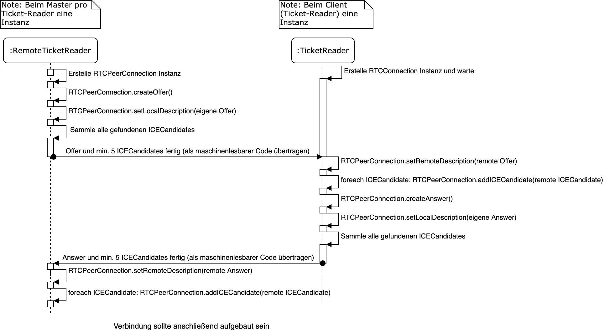

Die Kommunikation per RTCPeerConnection erfolgt über einen sogenannten Datachannel. Pro Ende-zu-Ende (Master->Client) Verbindung gibt es einen eigenen Datachannel. Dennoch könnten verschiedene Befehle über diesen Channel geschickt werden. Beispielsweise, um ein Ticket auszulesen oder es zu entwerten. Aber auch andere Anfragen oder Ereignisse könnten zukünftig auch vom Master aus an jeden einzelnen Ticketleser verschickt werden. Damit die Systeme die verschiedenen Nachrichtenarten (Anfragen bzw. Antworten) unterscheiden können und wissen, was sie damit anfangen sollen, wird ein einheitliches Protokoll mit definierten Datenstrukturen der Nachrichten benötigt. Im folgenden sind daher zwie Datenstrukturen definiert die zum Versenden von Anfragen oder Antworten genutzt werden.

**Nachrichten-Aufbau einer Anfrage:**

```
{ 
    type: "Request",  
    reqId: !Unique! String, 
    context: String, 
    method: String, 
    params: [Any]
}
```

**Nachrichten-Aufbau einer Antwort:**

```
{ 
    type: "Answer", 
    reqId: !Unique! String, 
    result: Any,
    error: String
}
```

Für das konkrete Konzept werden hauptsächlich Anfragen vom Ticket-Leser gestellt: 

1. Der Ticketleser liest ein Ticket aus und möchte die Informationen anzeigen.

2. Der Ticketleser möchte ein Ticket entwerten.

Grundsätzlich geht daraus hervor, dass die Nachricht vom Ticketleser zum entfernten Methodenaufruf den Nachrichtentyp „Anfrage“ oder „Request“ darstellen muss. Kommt diese Nachricht beim Master an, muss das Master-System wissen, welche Methode mit welchen Parametern ausgeführt werden soll. Aus diesem Grund muss eine Nachricht die Eigenschaften „method“ und „params“ mitliefern. Als zusätzliche Überlegung könnte es sinnvoll sein, dass verschiedene Methoden zu verschiedenen Anwendungskontexten gehören. Falls es beispielsweise nicht um die Ticket-Daten geht, sollten möglicherweise ganz andere System-Komponenten angesprochen werden. Mithilfe der Eigenschaft „context“ soll hierbei eine Unterscheidung auf der Empfängerseite ermöglicht werden. 

Nachdem beispielsweise die Methode readTicket() beim Master ausgeführt wurde, muss das Resultat an den Client (Anfragenden) zurückgeschickt werden. Hierfür bietet sich ein Nachrichtentyp mit dem Bezeichner „Answer“ an. Dieser enthält unter anderem das Ergebnis des Methodenaufrufs. Zusätzlich sollten alle Nachrichten mit dem Typ „Reqest“ eine eindeutige Anfrage-ID („reqId“) besitzen. Damit kann der Initiator der Anfrage eine spätere Antwort der ursprünglichen Anfrage zuzuordnen. Das bedeutet, auch die Nachrichten vom Typ “Answer“ müssen die entsprechende "reqId" ausweisen. 

Somit sind die Basis-Eigenschaften der Nachrichten einsatzbereit für einen entfernen Methoden-Aufruf mit anschließender Auswertung beim Initiator. Der Initiator kann ein Client sein, aber auch der Master könnte Anfragen an spezielle Clients schicken. Für die zwei Beispiel-Methoden gehen die Anfragen jedoch nur vom Client (Ticketleser) aus. 

# Entwicklung
This project was bootstrapped with [Create React App](https://github.com/facebook/create-react-app).

## Available Scripts

In the project directory, you can run:

### `npm run deploy`

Baut ein neues optimiertes package und publiziert es im Github-Branch gh-pages.
Dieser Branch wird von Github-Pages als Quelle verwendet. Aus diesem Grund muss das Repository public sein. Github-Pages ist aktiviert, damit die Web-App gleich nach dem deploy unter einer SSL-gesicherten Adresse getestet werden kann. Dies ist beispielsweise für die Kamera-Funktion (QR-Scannen) nötig!

Die Github-Page des Repositorys kann unter [https://bnt-is.github.io/bnt-frontend/](https://bnt-is.github.io/bnt-frontend/) aufgerufen werden.

### `npm start`

Runs the app in the development mode.<br />
Open [http://localhost:3000](http://localhost:3000) to view it in the browser.

The page will reload if you make edits.<br />
You will also see any lint errors in the console.

### `npm test`

Launches the test runner in the interactive watch mode.<br />
See the section about [running tests](https://facebook.github.io/create-react-app/docs/running-tests) for more information.

### `npm run build`

Builds the app for production to the `build` folder.<br />
It correctly bundles React in production mode and optimizes the build for the best performance.

The build is minified and the filenames include the hashes.<br />
Your app is ready to be deployed!

See the section about [deployment](https://facebook.github.io/create-react-app/docs/deployment) for more information.

### `npm run eject`

**Note: this is a one-way operation. Once you `eject`, you can’t go back!**

If you aren’t satisfied with the build tool and configuration choices, you can `eject` at any time. This command will remove the single build dependency from your project.

Instead, it will copy all the configuration files and the transitive dependencies (Webpack, Babel, ESLint, etc) right into your project so you have full control over them. All of the commands except `eject` will still work, but they will point to the copied scripts so you can tweak them. At this point you’re on your own.

You don’t have to ever use `eject`. The curated feature set is suitable for small and middle deployments, and you shouldn’t feel obligated to use this feature. However we understand that this tool wouldn’t be useful if you couldn’t customize it when you are ready for it.

## Learn More

You can learn more in the [Create React App documentation](https://facebook.github.io/create-react-app/docs/getting-started).

To learn React, check out the [React documentation](https://reactjs.org/).

### Code Splitting

This section has moved here: https://facebook.github.io/create-react-app/docs/code-splitting

### Analyzing the Bundle Size

This section has moved here: https://facebook.github.io/create-react-app/docs/analyzing-the-bundle-size

### Making a Progressive Web App

This section has moved here: https://facebook.github.io/create-react-app/docs/making-a-progressive-web-app

### Advanced Configuration

This section has moved here: https://facebook.github.io/create-react-app/docs/advanced-configuration

### Deployment

This section has moved here: https://facebook.github.io/create-react-app/docs/deployment

### `npm run build` fails to minify

This section has moved here: https://facebook.github.io/create-react-app/docs/troubleshooting#npm-run-build-fails-to-minify
